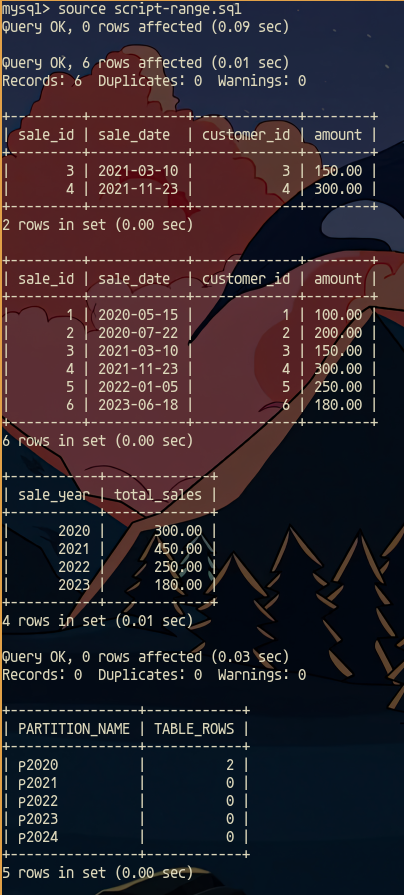
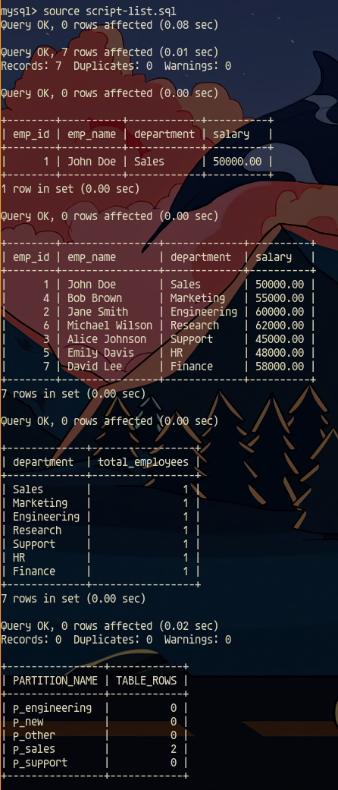
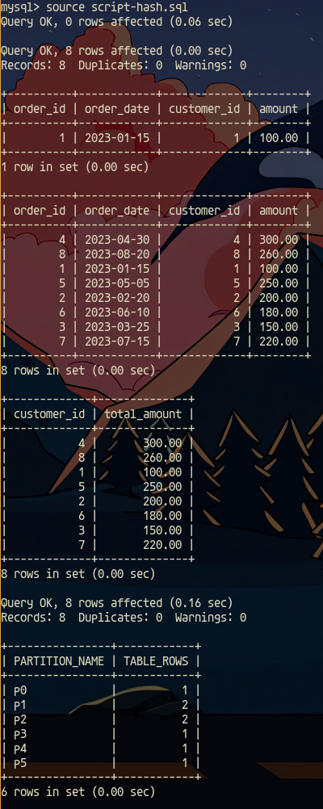

## Create database

Follow the next steps to create the database

- docker compose up -d

## Range partitioning

- docker ps
- docker cp script-range.sql container-id:/script-range.sql
- docker exec it container-id /bin/bash
- mysql -u root -p
- write the password "root" and enter
- use practice;
- source script-range.sql

The script apply range partitioning has been implemented in a MySQL sales table, with the aim of improving performance in queries that filter by the sales date. To achieve this, the table was partitioned based on the year of the sale date using the PARTITION BY RANGE (YEAR(sale_date)) clause. Each partition corresponds to a specific year, from 2020 to 2023 in this case. Sample data was then inserted into the table, followed by test queries to verify that the data would be distributed appropriately across the partitions and that the queries would execute efficiently. Additionally, an additional step will be provided to add a new partition for a future year if necessary, along with a query to verify the distribution of data between partitions. This range-sharing approach allows you to manage large volumes of data more efficiently by dividing it into logical segments, improving scalability and database query performance.

## List partitioning

- docker cp script-list.sql container-id:/script-list.sql
- docker exec it container-id /bin/bash
- mysql -u root -p
- write the password "root" and enter
- use practice;
- source script-list.sql

The script creates a list-partitioned employees table based on the department field, inserts sample data, runs queries to verify the data, and provides a method to verify the distribution of data across partitions. The primary key has been adjusted to include the department field, since the primary key is required to contain the partitioning column in MySQL.

## Hash partitioning

- docker cp script-hash.sql container-id:/script-hash.sql
- docker exec it container-id /bin/bash
- mysql -u root -p
- write the password "root" and enter
- use practice;
- source script-list.sql

The script now creates a hash-partitioned orders table based on the customer_id field, with customer_id included in the primary key. This setting ensures that the table meets the partitioning requirements in MySQL and resolves the error related to the primary key and partitioning columns.

