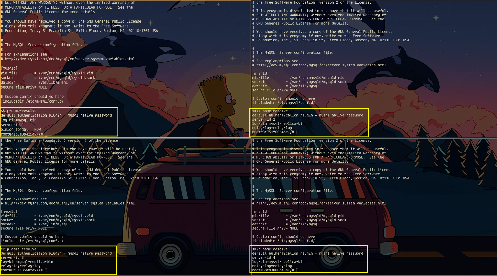
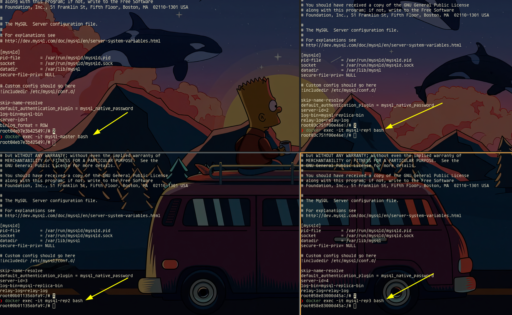
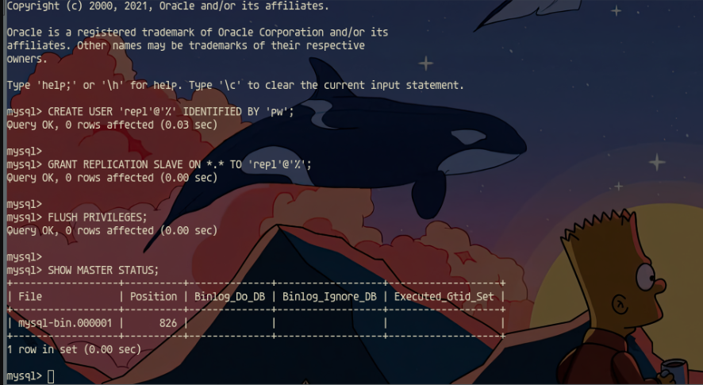
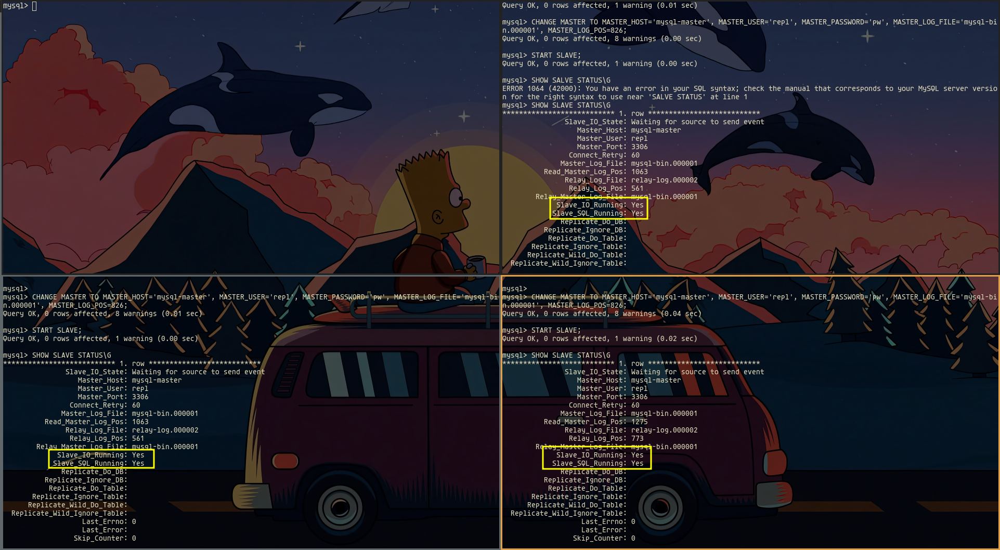
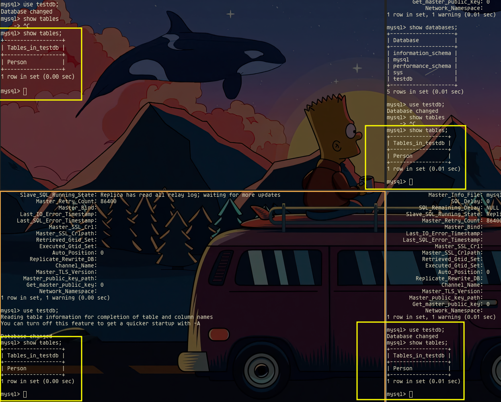
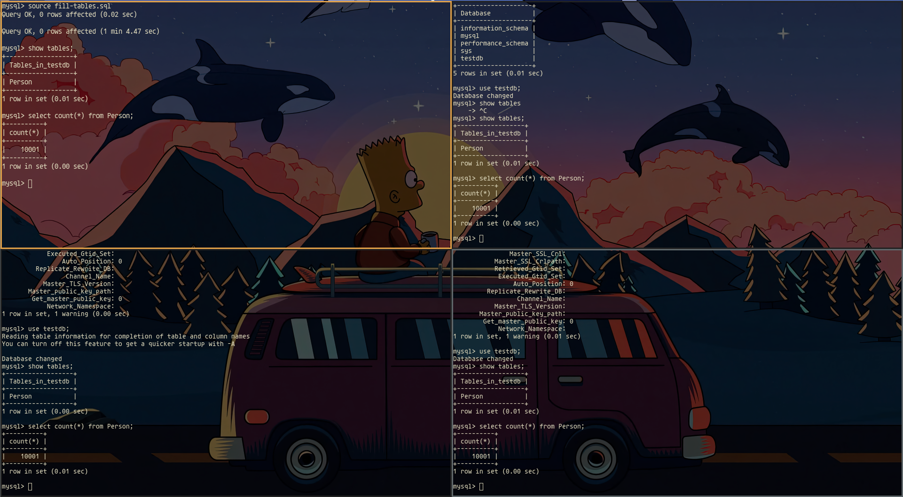

# Practice 2

Run docker-compose file.

```bash
$ docker compose up -d

# Review container creation
$ docker ps

# Enter on bash of mysql-master (principal node)
$ docker exec -it mysql-master /bin/bash

# Install text editor (vim)
$ apt update
$ apt install vim -y
```

It's necessary to install vim editor on all nodes, for enter on other docker nodes we can use the previus comand changin the id container name:

```bash
$ docker exec -it [container-name] /bin/bash

# Install text editor (vim)
$ apt update
$ apt install vim -y
```

# Setup servers
## Setup master node

```
skip-name-resolve
default_authentication_plugin = mysql_native_password
log-bin=mysql-bin
server-id=1
binlog_format = ROW
```

```bash
# Login on master node
$ mysql -u root -p'root'

# Edit my.cnf with vim and paste previus config at the end of file
$ vim /etc/mysql/my.cnf
```

## Setup other nodes
```
skip-name-resolve
default_authentication_plugin = mysql_native_password
server-id=2
log-bin=mysql-replica-bin
relay-log=relay-log
```

```bash
# Login on nodes
$ mysql -u root -p'root'

# Edit my.cnf with vim and paste previus config at the end of file
$ vim /etc/mysql/my.cnf
```



***Important: Each node should have different server-ids***

After modify all nodes restart the servers and login:

```bash
$ docker compose restart
```



On mysql master node, run the next commands to create a user:

```bash
mysql> CREATE USER 'repl'@'%' IDENTIFIED BY 'pw';

mysql> GRANT REPLICATION SLAVE ON *.* TO 'repl'@'%';

mysql> FLUSH PRIVILEGES;

mysql> SHOW MASTER STATUS;
```



Enter on each no master node servers and run:

```bash
# If not loged
$ mysql -u root -p'root'

mysql> CHANGE MASTER TO MASTER_HOST='mysql-master', MASTER_USER='repl', MASTER_PASSWORD='pw', MASTER_LOG_FILE='mysql-bin.000001', MASTER_LOG_POS=826;

mysql> START SLAVE;

mysql> SHOW SLAVE STATUS\G
```



***Important, MASTER_LOG_POS value should be the same showed by `SHOW MASTER STATUS;` query of master node***

Copy scripts on master database:

```bash
$ docker cp create-tables.sql mysql-master:/create-tables.sql
$ docker cp fill-tables.sql mysql-master:/fill-tables.sql
```

Run scripts (stay loged on master node) and verify data:

```bash
mysql> use testdb;
mysql> source create-tables.sql
mysql> source fill-tables.sql
mysql> show tables;
```



On each node:
```bash
mysql> select count(*) from Person;
```



All nodes share the data with the master node!