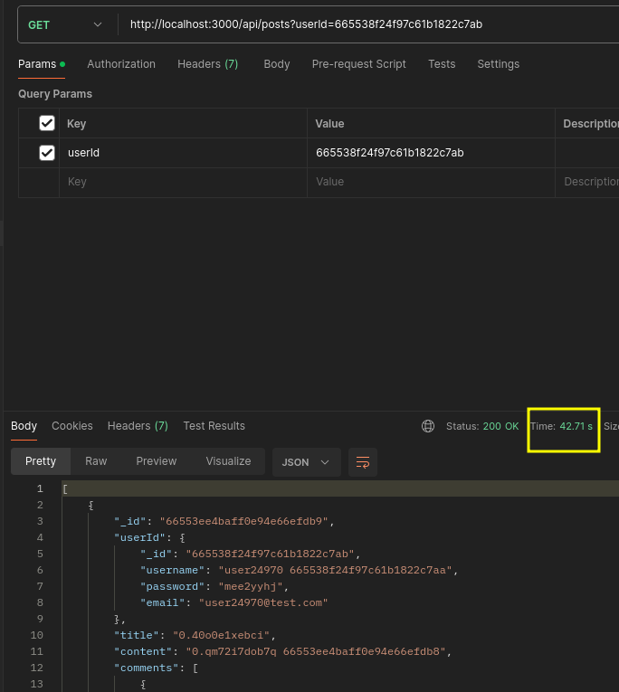

## Use case
Recover N number of posts realiced by some user.

***The use case is based on an scenary proposed of class session class. It's necessary to use the data provide on this session.***

## Resources of MongoDB
```
services:
  mo1:
    image: mongo
    container_name: mo1
    environment:
      MONGO_INITDB_ROOT_USERNAME: admin
      MONGO_INITDB_ROOT_PASSWORD: pw
    ports:
      - "27017:27017"
    volumes:
      - ./data:/data/db
    deploy:
      resources:
        limits:
          cpus: '1'
          memory: 600M
```

### Explanation of use case
At the moment to recover the posts realiced by some user the application have a problem to manage the big volume of data that have the table posts as shown in the following screens:





***We can found the rest of trys on screens/post/get-all-post-_-try.png is not attached hear to not charge the md file. So we can found screens of the rest of response times on the rest of screens.***

On screens we can see that the worst time that we get from server to response is 1m 11.70s, the reason of that is the code function get all data of collection.
To solve that we can follow strategies that allow us reduce the quantity of data retrieved. In this case we are follow an approach to manage the data with pagination.

### What's pagination?
Process of returning the results of a query in smaller subsets of data, or pages. It is a common practice to present results to a user in small, easy-to-manage chunks.

### Modified function
```js
router.get('/', async (req, res) => {
    try {
        const userId = req.query.userId;
        const page = parseInt(req.query.page) || 1;
        const limit = parseInt(req.query.limit) || 10;

        if (!userId) {
            return res.status(400).send({ error: 'User ID is required' });
        }

        const posts = await Post.find({ userId })
                                .populate('userId', 'fieldsToPopulate')
                                .skip((page - 1) * limit)
                                .limit(limit)
                                .select('fieldsToSelect');

        res.send(posts);
    } catch (error) {
        res.status(500).send(error);
    }
});
```

### Results after change
After use a pagination approach on query we get a great upgrade of the time request results passing to 2.49s, in this case we need to have in count that the time response depends of number of data request.


